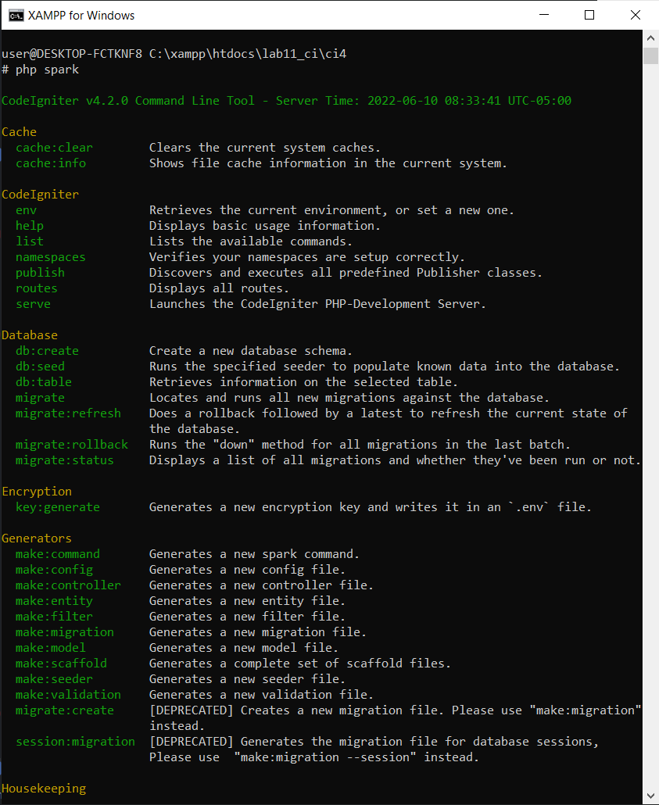

# Praktikum 11: PHP Framework (Codeigniter)

<h>

Untuk mengaktifkan ekstensi tersebut, melalui **XAMPP Control panel**, pada bagian apache klik **config -> PHP.in**


Pada bagian **extension=odbc**, hilangkan tanda ; (titik koma) pada ekstensi yang akan diaktifkan. Kemudian simpan kembali filenya dan restart Apache web server.


## Instalasi Codeigniter 4

Untuk melakukan instalasi Codeigniter 4 dapat dilakukan dengan dua cara, yaitu cara manual dan menggunakan _composer_. Pada praktikum ini kita menggunakan cara manual.

- Unduh Codeigniter dari website https://codeigniter.com/download
- Extrak file zip Codeigniter ke direktori htdocs/lab11_ci.
- Ubah nama direktory framework-4.x.xx menjadi ci4.
- Buka browser dengan alamat http://localhost/lab11_ci/ci4/public/


## Menjalankan CLI (Command Line Interface)

Codeigniter 4 menyediakan CLI untuk mempermudah proses development. Untuk
mengakses CLI buka terminal/command prompt.


Arahkan lokasi direktori sesuai dengan direktori kerja project dibuat
(xampp/htdocs/lab11_ci/ci4/).

<p>
Perintah yang dapat dijalankan untuk memanggil CLI CodeIgniter adalah:

`php spark`



## Mengaktifkan Mode Debugging

Codeigniter 4 menyediakan fitur **debugging** untuk memudahkan develper untuk mengetahui pesan error apabila terjadi kesalahan dalam membuat kode program.

<P> 
Secara default fitur ini belum aktif. Ketika terjadi error pada aplikasi akan ditampilkan pesan kesalahan seperti berikut.


Semua jenis error akan ditampilkan sama. Untuk memudahkan mengetahui jenis errornya, maka perlu diaktifkan mode debugging dengan mengubah nilai konfigurasi pada enironment variable **CI_ENVIRINMENT** menjadi **development.**


Ubah nama file **env** menjadi **.env** kemudian buka file tersebut dan ubah nilai variable **CI_ENVIRIMENT** menjadi **development.**

Contoh error yang terjadi untuk mencoba error tersebut ubah kode pada file **app/Controller/Home.php** hilangkan (;) pada akhir kode.


## Pembuatan Route Baru

Tambahkan kode berikut didalam **Routes.php**


```php
$routes->get('/about', 'Page::about');
$routes->get('/contact', 'Page::contact');
$routes->get('/faqs', 'Page::faqs');
```

Untuk mengetahui route yang ditambahkan sudah benar?
Buka CLI dan jalankan perintah berikut.

`php spark routes`


Selanjutnya coba akses route yang telah dibuat dengan mengakses alamat url http://localhost/lab11_php_ci/ci4/public/about


Ketika diakses akan muncul tampilan error 404 file not found, itu artinya file/page tersebut tidak ada. Untuk dapat mengakses halaman tersebut, harus dibuat terlebih dahulu Controller yang sesuai dengan routing yang dibuat yaitu Controller Page

## Membuat Controller

Selanjutnya adalah membuat Controller Page. Buat file baru dengan nama page.php pada direktori Controller kemudian isi kodenya seperti:

```php
<?php
namespace App\Controllers;
class Page extends BaseController
{
    public function about()
    {
        echo "Ini halaman About";
    }
    public function contact()
    {
        echo "Ini halaman contact";
    }
    public function faqs()
    {
        echo "Ini halaman FAQ";
    }
}
```

Selanjutnya refresh kembali browser, maka akan tampil hasilnya yaitu halaman sudah diakses


## Auto Routing

Secara default fitur _autoroute_ pada nilai Codeigniter sudah aktif. Untuk mengubah status autoroute dapat mengubah nilai variablenya. Untuk menonaktifkan ubah nilai **true** menjadi **false**

`$routes->setAutoRoute(true);`

Tambahkan method baru pada **Controller Page** seperti berikut:

```php
public function tos()
{
 echo "ini halaman Term of Services";
}
```

Method ini belum ada pada routing, sehingga cara mengakses nya dengan menggunakan alamat http://localhost/lab11_php_ci/ci4/public/page/tos


## Menmuat View

Selanjutnya adalah membuat view untuk menampilkan web agar lebih menarik. Buat file baru dengan nama about.php pada ditrektori view (**app/view/about.php**) kemudian isi kodenya seperti berikut.

```php
<!DOCTYPE html>
<html lang="en">
<head>
 <meta charset="UTF-8">
 <title><?= $title; ?></title>
</head>
<body>
 <h1><?= $title; ?></h1>
 <hr>
 <p><?= $content; ?></p>
</body>
</html>
```

Ubah Method about pada class controler page menjadi seperti

```php
public function about()
{
 return view('about', [
 'title' => 'Halaman Abot',
 'content' => 'Ini adalah halaman abaut yang menjelaskan tentang isi
halaman ini.'
 ]);
}
```

Kemudian lakukan refresh pada halaman tersebut.


## Membuat Layout Web dengan CSS

Pada dasarnya layout web dengan css dapat diimplementasikan dengan mudah pada codeigniter. yang perlu diketahui adalah, pada codeigniter 4 file yang menyimpan asset css dan javascript terletak pada direktori **public**.

Buat file css pada direktori public dengan nama style.css (copy file dari praktikum lab4_layout kita akan gunakan layout yang pernah dibuat pada praktikum 4.


Kemudaian buat folder **template** pada direktori **view** kemudian buat file **header.php** dan **footer.php**

File (**app/view/template/header.php**)

```html
<!DOCTYPE html>
<html lang="en">
  <link
    rel="stylesheet"
    href="https://cdn.jsdelivr.net/npm/bootstrap@4.0.0/dist/css/bootstrap.min.css"
    integrity="sha384-Gn5384xqQ1aoWXA+058RXPxPg6fy4IWvTNh0E263XmFcJlSAwiGgFAW/dAiS6JXm"
    crossorigin="anonymous"
  />
  <head>
    <meta charset="UTF-8" />
    <title><?= $title; ?></title>
    <link rel="stylesheet" href="style.css" />
  </head>

  <body>
    <div id="container">
      <header>
        <h1>Layout Sederhana</h1>
      </header>
      <nav>
        <a href="<?= base_url('/'); ?>" class="active">Home</a>
        <a href="<?= base_url('/artikel'); ?>">Artikel</a>
        <a href="<?= base_url('/about'); ?>">About</a>
        <a href="<?= base_url('/contact'); ?>">Kontak</a>
      </nav>
      <section id="wrapper">
        <section id="main"></section>
      </section>
    </div>
  </body>
</html>
```

File **app/view/template/footer.php**

```html
</section>
<aside id="sidebar">
    <div class="widget-box">
        <h3 class="title">Widget Header</h3>
        <ul>
            <li><a href="#">Widget Link</a></li>
            <li><a href="#">Widget Link</a></li>
        </ul>
    </div>
    <div class="widget-box">
        <h3 class="title">Widget Text</h3>
        <p>Vestibulum lorem elit, iaculis in nisl volutpat, malesuada
            tincidunt arcu. Proin in leo fringilla, vestibulum mi porta, faucibus felis.
            Integer pharetra est nunc, nec pretium nunc pretium ac.</p>
    </div>
</aside>
</section>
<footer>
    <p>&copy; 2022 - <i>val_18</i>  </p>
</footer>
</div>
</body>

</html>
```

Kemudia ubah file **app/view/about.php** dengan seperti berikut

```php
<?= $this->include('template/header'); ?>
<h1><?= $title; ?></h1>
<hr>
<p><?= $content; ?></p>
<?= $this->include('template/footer'); ?>
```

